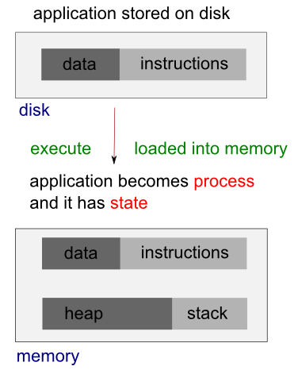

# LINUX PROCESSES AND SIGNALS

## Processes
The **signals** and **processes** control almost every task of the system.<br>
We get the following response at ``ps -ef`` commnand:

```bash
test-rhel: $ ps -af
UID        PID  PPID  C STIME TTY          TIME CMD
root         1     0  0 08:44 ?        00:00:01 /usr/lib/systemd/systemd --switched-root --system --deserialize 21
root         2     0  0 08:44 ?        00:00:00 [kthreadd]
root         3     2  0 08:44 ?        00:00:00 [ksoftirqd/0]
root         5     2  0 08:44 ?        00:00:00 [kworker/0:0H]
root         7     2  0 08:44 ?        00:00:00 [migration/0]
```


Each process is allocated a unique number, ``process identifier (PID)``. It's an integer between 2 and 32,768. When a process is started, the numbers restart from 2, and the number 1 is typically reserved for the ``init`` process as shown in the above example. The process #1 manages other processes.

When we run a program, the code that will be executed is stored in a disk file. In general, a linux process can't write to the memory area. The area is for holding the program code so that the code can be loaded into memory as read-only (so, it can be safely shared).



The system libraries can also be shared. Therefore, there need be only one copy of **printf()** in memory, even if there are many programs calling it.

When we run two programs, there are variables unique to each programs, unlike the shared libraries, these are in separate data space of each process, and usually can't be shared. In other words, a process has its own stack space, used for local variables. It also has its own environment variables which are maintained by each process. A process should also has its own program counter, a record of where it has gotten to in its execution (execution thread - more on linux pthread).


## Process Table

The process table describes all the processes that are currently loaded.<br> 
The **ps** command shows the processes. By default, it shows only processes that maintain a connection with a terminal, a console, a serial line, or a pseudo terminal. Other processes that can run without communication with a user on a terminal are system processes that Linux manages shared resources. To see all processes, we use **-e** option and **-f** to get full information (ps -ef).

## System Processes
Here is the **STAT** output from **ps**:

```bash
test-rhel: $ ps -ax
  PID TTY      STAT   TIME COMMAND
    1 ?        Ss     0:01 /usr/lib/systemd/systemd --switched-root --system --deserialize 21
    2 ?        S      0:00 [kthreadd]
    3 ?        S      0:00 [ksoftirqd/0]
    5 ?        S<     0:00 [kworker/0:0H]
    7 ?        S      0:00 [migration/0]
    8 ?        S      0:00 [rcu_bh]
    9 ?        S      0:03 [rcu_sched]
   10 ?        S      0:00 [watchdog/0]
   11 ?        S      0:00 [watchdog/1]
   12 ?        S      0:00 [migration/1]
   13 ?        S      0:00 [ksoftirqd/1]
...
   32 ?        SN     0:00 [ksmd]
   33 ?        SN     0:00 [khugepaged]
   34 ?        S<     0:00 [crypto]
   42 ?        S<     0:00 [kthrotld]
   43 ?        S      0:02 [kworker/u4:1]
...
 9214 pts/5    Ss     0:00 /bin/bash
 9418 pts/6    Ss+    0:00 /bin/bash
```
The meaning of the code is in the table below:

|  STAT Code | Description  |
|:---:|---|
| R | Running or runnable (either executing or about to run).  | 
| D	| Uninterruptible sleep (waiting) - usually waiting for input or output to complete.|
| S	| Sleeping. Usually waiting for an event to occur, such as a signal or input to become available.|
| T	| Stopped. Usually stopped by shell job control or the process is under the control of a debugger.|
| Z	| Defunct or zombie process.|
| N	| Low priority task, nice.|
| W	| Paging.|
| s	| The process is a session leader.|
| + | The process is in the foreground process group.|
| l	| The process is multithreaded.|
| <	| High priority task.|

Let's look at the following process:

```bash
 1 ?        Ss     0:01 /usr/lib/systemd/systemd --switched-root --system --deserialize 21
```

Each **child process** is started by **parent process.** When linux starts, it runs a single program **init**, with process id **#1**.<br>
This is **OS** Process manager, and its the prime ancestor of all processes.<br>
Then other system processes are started by **init** or by other processes strarted by **init**.<br>
The login procedure is one of the example, The **init** starts the **getty** program once for each terminal that we can use to login, and it is shown in the **ps** as I show bellow.

```bash
 3812 tty1     Ss+    0:00 /sbin/mingetty tty1
```

The **getty** processes wait for activity at the terminal, prompt the user with the login prompt and then pass control to the login program, which sets up the user environment, and starts a shell.<br>
When the user shell exists, **init** starts another **getty** process.

The Ability to **start new process** and to **wait for them to finish** is fundamental to the system.<br>
we can do the same thing within our own programs with the system calls **fork()**, **exec()** and **wait()**

## Process Scheduling